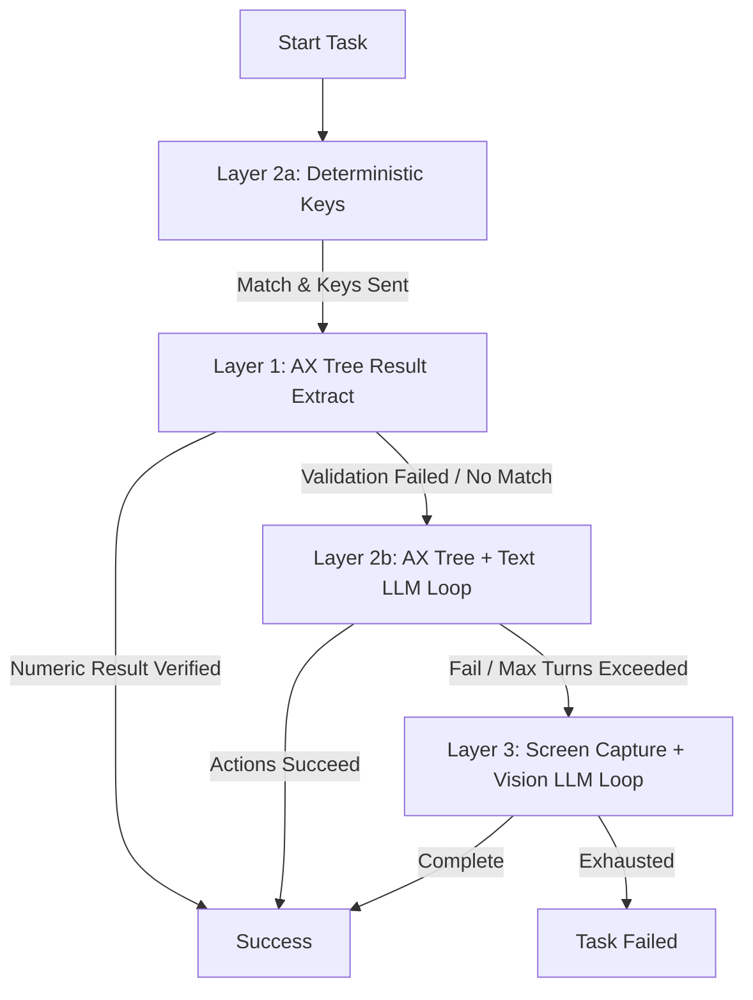

# EAGV3 Session 10 — Computer-Use Automation (CUA)

Welcome to Session 10 of the TSAI Agentic AI course. This repository contains the Computer-Use Automation (CUA) skill scaffolding, which implements a **four-layer cascade** over native macOS desktop applications using the `cua-driver` automation binary.

---

## 📂 Project Structure

```text
S10_CUA/
├── README.md             ← you are here
├── run_demo.sh           ← shortcut script to launch gateway and run tasks
├── logs/                 ← runtime process logs
│
├── code/                 ← agent codebase (run from here)
│   ├── flow.py           ← growing-graph orchestrator
│   ├── skills.py         ← skill registry & run dispatcher
│   ├── recovery.py       ← failure classifier & planner recovery loop
│   ├── schemas.py        ← Pydantic schemas (AgentResult, NodeSpec, etc.)
│   ├── replay.py         ← trace replay CLI tool
│   ├── persistence.py    ← session graph states persistence
│   │
│   ├── computer/         ← the Computer-Use (CUA) skill
│   │   ├── __init__.py
│   │   ├── skill.py      ← 4-layer cascade executor
│   │   └── driver.py     ← subprocess wrapper around the cua-driver CLI
│   │
│   ├── prompts/          ← skill prompts (planner.md, computer.md, etc.)
│   └── state/sessions/   ← session directories containing logs, screenshots, & videos
│
└── llm_gatewayV9/        ← FastAPI LLM Gateway service (runs on port 8108)
    ├── main.py
    └── run.sh
```

---

## ⚡ Quickstart

### Prerequisites
- macOS 15.0+ (required for native ScreenCaptureKit video capture)
- Python 3.11+
- [uv](https://docs.astral.sh/uv/) package manager
- `cua-driver` CLI binary (installed and granted Accessibility permissions)

### Setup & Run

1. **Configure Environment Secrets**:
   Copy `.env.example` in the `code/` directory to `.env` and fill in your API keys (e.g. Gemini, OpenAI):
   ```bash
   cp code/.env.example code/.env
   # Add your credentials
   ```

2. **Start the LLM Gateway**:
   In one terminal window, navigate to the gateway and start it:
   ```bash
   cd llm_gatewayV9
   ./run.sh
   ```

3. **Run a Computer-Use Task**:
   In another terminal, navigate to the `code/` folder and execute a query using the orchestrator:
   ```bash
   cd code
   uv run flow.py "open calculator and compute 15 + 23"
   ```

4. **Inspect the Session Report**:
   When the run completes, it generates an interactive browser report:
   ```text
   [report] /Volumes/lucky-dev/TSAI/AgenticAI/S10_CUA/code/state/sessions/<session_id>/report.html
   ```

---

## 🧱 The 4-Layer Cascade Architecture

The `ComputerSkill` class in `computer/skill.py` executes tasks using a prioritized sequence of escalation layers:



### 1. Layer 1 — AX Extract (Verification)
- A read-only verification layer that parses numeric values directly from the accessibility (`AX`) tree elements without triggering any LLM.

### 2. Layer 2a — Deterministic Calculator Hotkeys
- Automatically attempts to parse mathematical formulas from the user goal (e.g., `15 + 23`) and inputs the corresponding keys natively via the key map. This executes in under a second at **$0 LLM cost**.

### 3. Layer 2b — AX Tree + Text LLM Loop
- If the deterministic hotkey layer fails or is not applicable, the agent reads the app's `AX` tree, prompts a text LLM to determine the next accessibility action (`press_key`, `click`, or `type_text`), and executes it in a multi-turn feedback loop.

### 4. Layer 3 — Screen Capture + Vision LLM Loop
- As a last resort, the agent captures the window screenshot, passes it to a Multimodal Vision LLM, coordinates pixel-level coordinates, clicks, or text input actions, and verifies state visually.

---

## 📹 Trajectory Recording & Video Playback

By default, the CUA skill records step-by-step logs and screenshots under `state/sessions/<session_id>/computer/recording/`:
- `screenshot.png` — Post-action window-level crop of the application.
- `click.png` — Visual indicator showing where the agent clicked.
- `app_state.json` — Pre/post AX Tree structure.

### Enable Continuous Video Capture
To record a continuous H.264 video (`recording.mp4`) of the main display during the session, update [skill.py](file:///Volumes/lucky-dev/TSAI/AgenticAI/S10_CUA/code/computer/skill.py):
```python
await self._call("start_recording", {
    "output_dir": str(rec_dir),
    "record_video": True, # Set to True to record display
})
```

### Compile Video with Action Overlays
Rendering visual overlay indicators (e.g., red dots for clicks, key-press annotations) onto the video requires `ffmpeg`:
```bash
# 1. Install ffmpeg
brew install ffmpeg

# 2. Render overlays using cua-driver
cua-driver recording render state/sessions/<session_id>/computer/recording --output action_video.mp4
```
